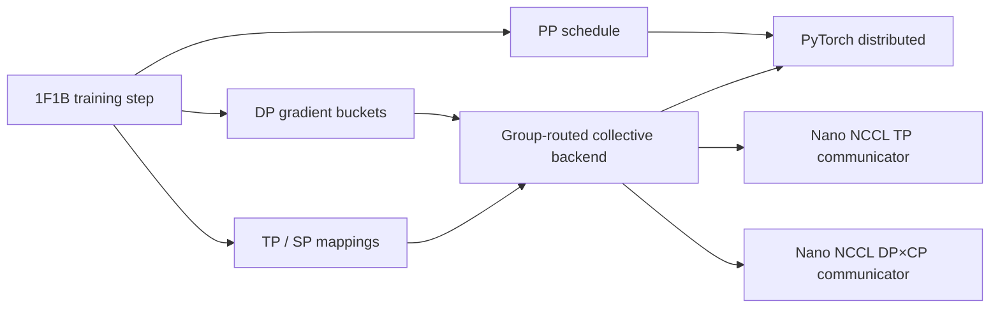

# nano-megatron

Compact PyTorch/CUDA training framework that independently implements and
validates the core parallelism mechanisms used by Megatron-style LLM systems.

中文文档: [README_zh.md](README_zh.md)

## Features

| Parallelism / feature | Status | Notes |
|----------------------|--------|--------|
| Data Parallel (DP) | Supported | Custom DDP; persistent contiguous gradient buckets; ready-parameter async AllReduce |
| Tensor Parallel (TP) | Supported | Column/row parallel; QKV/SwiGLU and vocabulary sharding; dgrad collective overlap |
| Sequence Parallel (SP) | Supported | Tensor AllGather/ReduceScatter on the TP group; coalesced replicated-parameter gradients |
| Pipeline Parallel (PP) | Supported | Non-interleaved 1F1B; batched bidirectional P2P |
| Context Parallel (CP) | Supported | AG-KV + chunked FA (default **prefix-concat** multi-block, `NANO_CP_FA_CHUNK`); pack `contiguous` (default) or `zigzag`; not P2P ring; no PP/SP combo; wrap DDP when `cp>1` |
| FlashAttention | Supported | Optional `flash-attn`; `attn_backend=auto\|flash\|unfused`; TP + CP |
| TP × DP / TP × PP / DP × PP / TP × SP × PP × DP | Supported | Composable via `ParallelContext`; combined path validated against the unsharded reference |
| TP × CP / CP × DP | Supported | Composable via `ParallelContext` |
| [Nano NCCL](https://github.com/zhoujuan0305/nano-nccl) collectives | Optional | Per-group ABI v2 communicators replace every training-path TP/SP and DP AllReduce, AllGather, and ReduceScatter; PP P2P stays on PyTorch distributed |
| ZeRO | Planned | — |

PyTorch tensors, autograd, CUDA, and distributed collectives are used directly. Communication goes through a small `CommBackend` abstraction (default: PyTorch distributed).

## Design



`ParallelContext` constructs orthogonal process groups from rank coordinates.
The model and parallel layers depend only on the communication interfaces;
the routed backend selects a communicator by process-group identity. Reference
and sharded models can be initialized from the same weights so tests compare
logits, loss, and local parameter gradients directly.

## Performance

### Two-node TP2 × SP × PP2 × DP2

The current integrated benchmark uses a 1.424B-parameter GPT, BF16,
sequence length 2048, and 8× RTX A6000 across two nodes. TP and PP stay within
each node; every DP pair crosses nodes. A measured step includes forward,
backward, TP/SP communication, PP P2P, and final DP gradient synchronization,
and excludes the optimizer update.

| Path | Global tok/s | Step ms | Relative result |
|------|-------------:|--------:|-----------------|
| nano-megatron + Nano NCCL, synchronous | 17,221.76 | 475.68 | — |
| nano-megatron + Nano NCCL, DP+TP overlap | **19,263.63** | **425.26** | **+11.86%** vs synchronous |
| nano-megatron + PyTorch NCCL GDR=0, DP+TP overlap | 19,974.20 | 410.13 | Nano NCCL retains **0.964x** |
| Megatron-LM/TE + NCCL GDR=0 | 18,958.51 | 432.10 | Nano path median is **1.016x** |

Values are medians of five rotating, interleaved repetitions with five warmup
and twenty measured steps. Nano NCCL and PyTorch NCCL use the same connection
setting for the backend A/B; Megatron uses its recommended setting. The
framework ranges overlap, so the 1.016x result is evidence of parity on this
workload rather than a general performance claim. See the
[experiment record](https://github.com/zhoujuan0305/experiments/tree/main/nano-megatron/nano-nccl-collectives/runs/run-20260907-002)
for raw aggregates, topology controls, and scope.

### Earlier single-node baselines

On 4× RTX A6000, matching GPT configs **345M / 760M / 1.3B** against
Megatron-LM (TE):

| Mode | Precision | nano / Megatron throughput | Notes |
|------|-----------|----------------------------|--------|
| TP / TP+SP | FP32 | **0.93x – 1.01x** | Unfused attention (FA needs half precision) |
| DP / TP×DP | FP32 | **0.97x – 1.05x** | |
| PP | FP32 | **1.00x – 1.04x** | |
| TP×PP | FP32 | **~0.92x** | |
| TP / TP+SP | **BF16 + FA** | **0.87x – 0.92x** | All three sizes |
| DP2 | **BF16 + FA** | **0.95x – 1.01x** | Mem **0.77x – 0.81x** |
| CP2 | **BF16 + FA** | **0.81x – 0.83x** (contiguous pack) | Default pack **contiguous** + prefix-concat multi-block FA; zigzag pack optional (`--cp-pack`); mem often lower |

Full tables (per size): **[performance.md](performance.md)** §2.1 (345M) · §3.1 (760M) · §4.1 (1.3B).

## Quick Start

### Installation

```bash
pip install -e ".[dev]"
```

### Optional: FlashAttention

`flash-attn` is an optional dependency. Install it separately for faster half-precision attention:

```bash
pip install flash-attn
```

Set the attention backend in `ReferenceGPTConfig`:

```python
config = ReferenceGPTConfig(attn_backend="auto")  # default
```

| `attn_backend` | Behaviour |
|----------------|-----------|
| `"auto"` | Uses FlashAttention when CUDA + fp16/bf16 + `flash-attn` installed; falls back to unfused otherwise |
| `"flash"` | Requires CUDA + fp16/bf16 + `flash-attn`; raises `RuntimeError` if unavailable |
| `"unfused"` | Always uses the reference scores→softmax→matmul path |

**Context Parallel (CP) notes:** The CP flash path is all-gather KV + multi-block FlashAttention (not a TE P2P ring). Multi-block FA defaults to **prefix-concat** (`NANO_CP_FA_CHUNK=prefix`): concatenate non-causal KV blocks into one FA call, plus one causal FA on the local block, then online-softmax combine (≤2 launches per Q-shard). Set `NANO_CP_FA_CHUNK=legacy` for one FA launch per KV block. Sequence pack is `ParallelConfig.context_parallel_pack` / bench `--cp-pack {contiguous,zigzag}` (default **contiguous**). `attention_dropout > 0` with `cp > 1` is **unsupported** in the flash CP path (the multi-block backward cannot propagate dropout RNG state).

### Run Reference Model

```bash
python scripts/run_reference_gpt.py --seed 0 --steps 3 --device cpu --out ref_traj.pt
```

### Benchmarks (vs Megatron-LM)

Requires Megatron-LM on `PYTHONPATH`. Prefer separate `--framework nano` / `--framework megatron` runs for fair peak memory (DP/PP/CP).

```bash
export PYTHONPATH=/path/to/nano-megatron:/path/to/Megatron-LM:$PYTHONPATH
export CUDA_DEVICE_MAX_CONNECTIONS=1

# --- BF16 + FlashAttention (345M TP2; needs flash-attn) ---
python -m torch.distributed.run --standalone --nproc_per_node=2 \
  scripts/benchmark_tp.py --framework nano --tp-size 2 --precision bf16 --attn-backend flash \
  --batch-size 2 --seq-len 2048 --hidden-size 1024 --num-layers 24 \
  --num-heads 16 --ffn-hidden-size 4096
python -m torch.distributed.run --standalone --nproc_per_node=2 \
  scripts/benchmark_tp.py --framework megatron --tp-size 2 --precision bf16 \
  --batch-size 2 --seq-len 2048 --hidden-size 1024 --num-layers 24 \
  --num-heads 16 --ffn-hidden-size 4096

# 760M:  --hidden-size 1536 --ffn-hidden-size 6144 --batch-size 2
# 1.3B:  --hidden-size 2048 --ffn-hidden-size 8192 --batch-size 1  (TP2/DP/CP; TP4 uses batch=2)
# DP2 / CP2: scripts/benchmark_dp.py | benchmark_cp.py  + same --precision bf16 [--attn-backend flash]
# CP pack A/B (nano): benchmark_cp.py --framework nano --cp-pack contiguous|zigzag

# --- FP32 baseline (TP2 345M) ---
python -m torch.distributed.run --standalone --nproc_per_node=2 \
  scripts/benchmark_tp.py --framework both --tp-size 2 \
  --batch-size 2 --seq-len 2048 --hidden-size 1024 --num-layers 24 \
  --num-heads 16 --ffn-hidden-size 4096

# PP2 (1F1B, FP32)
python -m torch.distributed.run --standalone --nproc_per_node=2 \
  scripts/benchmark_pp.py --framework nano --pp-size 2 --tp-size 1 \
  --batch-size 8 --num-microbatches 4 --seq-len 1024 \
  --hidden-size 1024 --num-layers 24 --num-heads 16 --ffn-hidden-size 4096

# TP2×SP×DP2 with Nano NCCL collectives (one MPI process per GPU)
mpirun -n 4 <rank-env-wrapper> python scripts/benchmark_pp.py \
  --framework nano --tp-size 2 --pp-size 1 --dp-size 2 --sequence-parallel \
  --collective-backend nano-nccl \
  --nano-nccl-library /path/to/libnano_nccl_mpi_c.so \
  --nano-nccl-transport auto --overlap-grad-reduce --overlap-tp-dgrad
```

`<rank-env-wrapper>` maps MPI world/local ranks to PyTorch's
`WORLD_SIZE`/`RANK`/`LOCAL_RANK` environment. The accepted two-node launcher
and topology mapping are available with the
[experiment scripts](https://github.com/zhoujuan0305/experiments/tree/main/nano-megatron/nano-nccl-collectives/scripts).

The Nano NCCL factory creates one communicator for each active TP and DP×CP
group and routes AllReduce, AllGather, and ReduceScatter by process-group
identity. Broadcasts, barriers, and pipeline send/recv use the PyTorch
fallback. All ranks must enter communicator creation in the same order, and
the native library's compile-time rank count must equal each routed group
size. Nano NCCL is an optional scoped backend, not an NCCL API-compatible
replacement.

All sizes and modes: [performance.md](performance.md).

### Verify Architecture

```bash
python scripts/verify_architecture.py
```

### Run Tests

```bash
# Unit tests
PYTHONPATH=. python -m pytest tests/unit -v

# Distributed tests (multi-process; some need multi-GPU / NCCL)
PYTHONPATH=. python -m pytest tests/distributed tests/integration -v
```

## License

This project is licensed under the MIT License - see the [LICENSE](LICENSE) file for details.
