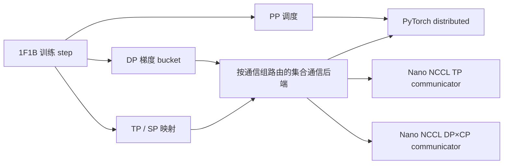

# nano-megatron

基于 PyTorch/CUDA 独立实现并验证 Megatron 风格大模型核心并行机制的紧凑训练框架。

English README: [README.md](README.md)

## 功能

| 并行 / 能力 | 状态 | 说明 |
|-------------|------|------|
| 数据并行 (DP) | 已支持 | 自定义 DDP；持久化连续梯度 bucket；参数就绪异步 AllReduce |
| 张量并行 (TP) | 已支持 | Column/Row Parallel；QKV/SwiGLU 与词表切分；dgrad 集合通信重叠 |
| 序列并行 (SP) | 已支持 | 在 TP group 上执行 tensor AllGather/ReduceScatter；合并复制参数梯度 |
| 流水线并行 (PP) | 已支持 | 非交错 1F1B；双向 batched P2P |
| 上下文并行 (CP) | 已支持 | AG-KV + 分块 FA（默认 **prefix-concat** 多块，`NANO_CP_FA_CHUNK`）；pack 默认 `contiguous`，可选 `zigzag`；非 P2P ring；不与 PP/SP 组合；`cp>1` 时包 DDP |
| FlashAttention | 已支持 | 可选 `flash-attn`；`attn_backend=auto\|flash\|unfused`；覆盖 TP + CP |
| TP×DP / TP×PP / DP×PP / TP×SP×PP×DP | 已支持 | 通过 `ParallelContext` 组合；组合路径已对齐未切分参考实现 |
| TP×CP / CP×DP | 已支持 | 通过 `ParallelContext` 组合 |
| [Nano NCCL](https://github.com/zhoujuan0305/nano-nccl) 集合通信 | 可选 | 为各通信组创建 ABI v2 communicator，替换训练主路径 TP/SP 与 DP 的全部 AllReduce、AllGather、ReduceScatter；PP P2P 仍走 PyTorch distributed |
| ZeRO | 规划中 | — |

可直接使用 PyTorch tensor、autograd、CUDA 与分布式通信原语。通信经小型 `CommBackend` 抽象（默认包装 PyTorch distributed）。

## 设计



`ParallelContext` 根据 rank 坐标统一构造正交通信组；模型和并行层只依赖通信
接口，路由后端按 process-group 对象选择 communicator。参考模型与切分模型可
从同一份权重初始化，测试直接对比 logits、loss 与各 rank 的局部参数梯度。

## 性能

### 双节点 TP2 × SP × PP2 × DP2

当前集成测试采用 1.424B 参数 GPT、BF16、序列长度 2048 和双节点
8× RTX A6000。TP 与 PP 留在单机，每个 DP 对跨节点。计时范围包含前向、
反向、TP/SP 通信、PP P2P 和最终 DP 梯度同步，不包含优化器更新。

| 路径 | 全局 tok/s | Step ms | 相对结果 |
|------|-----------:|--------:|----------|
| nano-megatron + Nano NCCL，同步通信 | 17,221.76 | 475.68 | — |
| nano-megatron + Nano NCCL，DP+TP overlap | **19,263.63** | **425.26** | 相对同步路径 **+11.86%** |
| nano-megatron + PyTorch NCCL GDR=0，DP+TP overlap | 19,974.20 | 410.13 | Nano NCCL 保持 **0.964x** |
| Megatron-LM/TE + NCCL GDR=0 | 18,958.51 | 432.10 | Nano 路径中位吞吐为 **1.016x** |

数据为五轮旋转交错实验的中位数，每轮 warmup 5 step、测量 20 step。
Nano NCCL 与 PyTorch NCCL 的后端 A/B 使用相同连接设置，Megatron 使用其
推荐设置。两条框架路径的五轮区间存在重叠，因此 1.016x 表示该工作负载下
性能持平，不代表普遍快于 Megatron-LM。原始汇总、拓扑控制实验和适用范围见
[实验记录](https://github.com/zhoujuan0305/experiments/tree/main/nano-megatron/nano-nccl-collectives/runs/run-20260907-002)。

### 早期单机基线

在 4× RTX A6000、相同 GPT 配置 **345M / 760M / 1.3B** 下对比
Megatron-LM（TE）：

| 模式 | 精度 | nano / Megatron 吞吐比 | 说明 |
|------|------|------------------------|------|
| TP / TP+SP | FP32 | **0.93x – 1.01x** | unfused attention（FA 需半精度） |
| DP / TP×DP | FP32 | **0.97x – 1.05x** | |
| PP | FP32 | **1.00x – 1.04x** | |
| TP×PP | FP32 | **约 0.92x** | |
| TP / TP+SP | **BF16 + FA** | **0.87x – 0.92x** | 三个规模均覆盖 |
| DP2 | **BF16 + FA** | **0.95x – 1.01x** | 显存 **0.77x – 0.81x** |
| CP2 | **BF16 + FA** | **0.81x – 0.83x**（contiguous pack） | 默认 pack **contiguous** + prefix-concat 多块 FA；zigzag 可选（`--cp-pack`）；显存常更低 |

完整表格（按规模）：**[performance.md](performance.md)** §2.1（345M）· §3.1（760M）· §4.1（1.3B）。

## 快速开始

### 安装

```bash
pip install -e ".[dev]"
```

### 可选：FlashAttention

`flash-attn` 是可选依赖。单独安装以加速半精度注意力：

```bash
pip install flash-attn
```

在 `ReferenceGPTConfig` 中设置注意力后端：

```python
config = ReferenceGPTConfig(attn_backend="auto")  # 默认
```

| `attn_backend` | 行为 |
|----------------|------|
| `"auto"` | 当 CUDA + fp16/bf16 + `flash-attn` 已安装时使用 FlashAttention；否则回退到 unfused |
| `"flash"` | 要求 CUDA + fp16/bf16 + `flash-attn`；不可用时抛出 `RuntimeError` |
| `"unfused"` | 始终使用参考实现：scores→softmax→matmul |

**上下文并行（CP）说明：** CP flash 路径为 all-gather KV + 多块 FlashAttention（非 TE P2P ring）。多块 FA 默认 **prefix-concat**（`NANO_CP_FA_CHUNK=prefix`）：将非因果 KV 块拼接为一次 FA，再对本地块做一次因果 FA，最后 online-softmax 合并（每个 Q-shard ≤2 次 launch）；`legacy` 为每个 KV 块一次 launch。序列 pack 由 `ParallelConfig.context_parallel_pack` / bench `--cp-pack {contiguous,zigzag}` 控制（默认 **contiguous**）。`attention_dropout > 0` 且 `cp > 1` 时，flash CP 路径**不支持**（多块反向无法传递 dropout RNG 状态）。

### 运行参考模型

```bash
python scripts/run_reference_gpt.py --seed 0 --steps 3 --device cpu --out ref_traj.pt
```

### 基准测试（对比 Megatron-LM）

需将 Megatron-LM 加入 `PYTHONPATH`。为公平对比峰值显存，建议 DP/PP/CP 分别用 `--framework nano` 与 `--framework megatron` 各跑一次。

```bash
export PYTHONPATH=/path/to/nano-megatron:/path/to/Megatron-LM:$PYTHONPATH
export CUDA_DEVICE_MAX_CONNECTIONS=1

# --- BF16 + FlashAttention（345M TP2；需安装 flash-attn）---
python -m torch.distributed.run --standalone --nproc_per_node=2 \
  scripts/benchmark_tp.py --framework nano --tp-size 2 --precision bf16 --attn-backend flash \
  --batch-size 2 --seq-len 2048 --hidden-size 1024 --num-layers 24 \
  --num-heads 16 --ffn-hidden-size 4096
python -m torch.distributed.run --standalone --nproc_per_node=2 \
  scripts/benchmark_tp.py --framework megatron --tp-size 2 --precision bf16 \
  --batch-size 2 --seq-len 2048 --hidden-size 1024 --num-layers 24 \
  --num-heads 16 --ffn-hidden-size 4096

# 760M:  --hidden-size 1536 --ffn-hidden-size 6144 --batch-size 2
# 1.3B:  --hidden-size 2048 --ffn-hidden-size 8192 --batch-size 1（TP2/DP/CP；TP4 用 batch=2）
# DP2 / CP2: scripts/benchmark_dp.py | benchmark_cp.py  + 同样 --precision bf16 [--attn-backend flash]

# --- FP32 基线（TP2 345M）---
python -m torch.distributed.run --standalone --nproc_per_node=2 \
  scripts/benchmark_tp.py --framework both --tp-size 2 \
  --batch-size 2 --seq-len 2048 --hidden-size 1024 --num-layers 24 \
  --num-heads 16 --ffn-hidden-size 4096

# PP2（1F1B，FP32）
python -m torch.distributed.run --standalone --nproc_per_node=2 \
  scripts/benchmark_pp.py --framework nano --pp-size 2 --tp-size 1 \
  --batch-size 8 --num-microbatches 4 --seq-len 1024 \
  --hidden-size 1024 --num-layers 24 --num-heads 16 --ffn-hidden-size 4096

# TP2×SP×DP2 使用 Nano NCCL 集合通信（每个 GPU 一个 MPI 进程）
mpirun -n 4 <rank-env-wrapper> python scripts/benchmark_pp.py \
  --framework nano --tp-size 2 --pp-size 1 --dp-size 2 --sequence-parallel \
  --collective-backend nano-nccl \
  --nano-nccl-library /path/to/libnano_nccl_mpi_c.so \
  --nano-nccl-transport auto --overlap-grad-reduce --overlap-tp-dgrad
```

`<rank-env-wrapper>` 负责将 MPI world/local rank 映射到 PyTorch 使用的
`WORLD_SIZE`/`RANK`/`LOCAL_RANK` 环境变量；已验收的双节点启动器与拓扑映射见
[实验脚本](https://github.com/zhoujuan0305/experiments/tree/main/nano-megatron/nano-nccl-collectives/scripts)。

Nano NCCL factory 为活跃的 TP 与 DP×CP group 分别创建 communicator，并按
process-group 对象路由 AllReduce、AllGather 与 ReduceScatter。广播、barrier
与流水线 send/recv 仍使用 PyTorch fallback。所有 rank 必须按相同顺序创建
communicator；原生库的编译期 rank 数必须等于每个被路由 group 的大小。
Nano NCCL 是可选的限定范围后端，不承诺兼容 NCCL API。

全部规模与并行组合见 [performance.md](performance.md)。

### 验证模型结构

```bash
python scripts/verify_architecture.py
```

### 运行测试

```bash
# 单元测试
PYTHONPATH=. python -m pytest tests/unit -v

# 分布式测试（多进程；部分用例需要多卡 / NCCL）
PYTHONPATH=. python -m pytest tests/distributed tests/integration -v
```

## 许可证

本项目采用 MIT 许可证 - 详见 [LICENSE](LICENSE) 文件。
